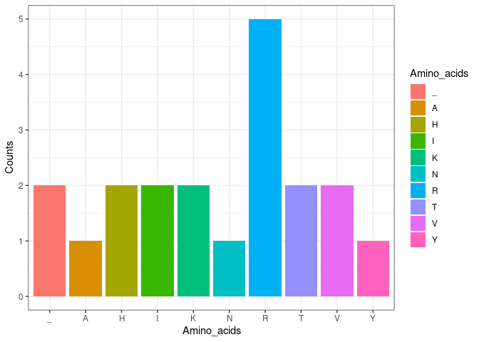

centralDogma - Group 6
================

Library import:

``` r
library(centralDogma)
```

# Brief description of the use of this package

The package works much like a logo-plot, but much simpler. Converts a
DNA-string to an amino acid sequence, and plots their respective
frequencies.

Notice that each function is demonstrated using the output from the
previous function.

# Examples of each function

## create_random_dna_seq

`create_random_dna_seq()` takes as an argument an integer, and returns a
randomly generated DNA-sequence of that length:

``` r
(dna_seq <- create_random_dna_seq(seq_length = 60))
#> [1] "ACTATTCATAGAATCAAAGTAGCGAGGTAGCATTATCGCAGAACGGTGTAGAAAAACAGG"
```

## convert_dna_to_rna

`convert_dna_to_rna()` takes as an argument a DNA-sequence, and returns
a RNA-sequence:

``` r
(rna_seq <- convert_dna_to_rna(dna_str = dna_seq))
#> [1] "ACUAUUCAUAGAAUCAAAGUAGCGAGGUAGCAUUAUCGCAGAACGGUGUAGAAAAACAGG"
```

## codon_iden

`codon_iden()` splits the RNA-sequence into codons as below:

``` r
(codons <- codon_iden(RNA_seq = rna_seq, start = 1))
#>  [1] "ACU" "AUU" "CAU" "AGA" "AUC" "AAA" "GUA" "GCG" "AGG" "UAG" "CAU" "UAU"
#> [13] "CGC" "AGA" "ACG" "GUG" "UAG" "AAA" "AAC" "AGG"
```

## translate_codon

`translate_codon()` takes codons as input in a vector, and translate
into a string of amino acids:

``` r
(aa_seq <- translate_codon(codons))
#> [1] "TIHRIKVAR_HYRRTV_KNR"
```

## get_freq_plot

`get_freq_plot()` takes a string of amino acids, and plot their
frequencies:

``` r
get_freq_plot(aa_seq)
```

<!-- -->

# Other uses and functions

If the distribution of amino acids is required, this package is up for
the task. It is also possible to plot the frequencies of
DNA/RNA-sequences, as the plot function doesn’t seach for unique
patterns, but patterns based on the input. Furthermore, each function
can be used on their own, on doesn’t necessarily need to result in a
frequency plot.

Functions for reverse transcription, or similar, could be easily
implemented. These should also work in conjunction with
`get_freq_plot()`.

# Discussion from Task 4

A package shouldn’t contain too many dependencies, as this would result
in a increase in maintenance. As other packages (dependencies) are
updated, one should make sure, that this update is compatible with our
package.

Further, the need for dependencies forces the user to download more
packages which isn’t desirable.

If many supporter functions are used, it can be troublesome to recognize
each of them and their origin. Therefore, the package names should be
included as `package::function()`.
